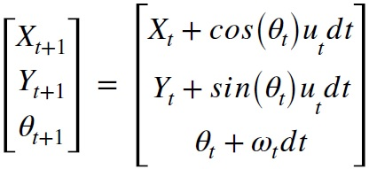
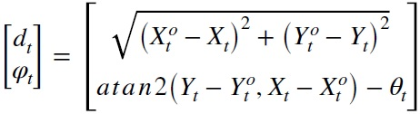
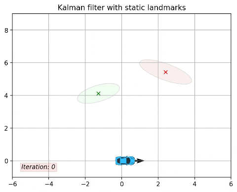
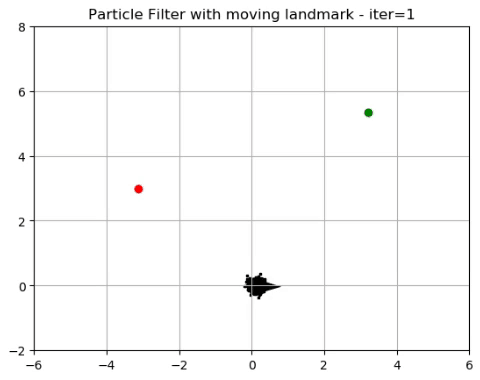

# EstimationTheory
Estimation of vehicle and obstacles positions using Extended Kalman and Particle filters

## Summary

  - [Description of the problem](#description-of-the-problem)
  - [Description of the repository](#description-of-the-repository)
  - [Requirements](#requirements)
  - [Usage](#usage)
  - [Results](#results)
  - [Acknowledgments](#acknowledgments)

## Description of the problem
Suppose a vehicle moves in a plane (2 dimensions). The vehicle monitors two fixed obstacles on the same level as the vehicle. The estimator is asked to calculate at each time point the best estimate of the position and orientation of the vehicle and the position of the obstacles. The motion model of the vehicle is given by the equation:



While the model for measuring the position of obstacles is given by the equation:



Where X<sup>o</sup> and Y<sup>o</sup> are the coordinates of the vehicle at time t. The noise entering the measurement system is Gaussian with an average value of 0 and a standard deviation σ.

### Task 1
Estimate the 7 states using the Extended Kalman Filter. The observation made by the vehicle is the angle and the distance at which the vehicle "sees" each obstacle. The angle is measured in relation to the longitudinal axis of the vehicle. The direction is counterclockwise. In fact, this measurement is noisy. Also the vehicle moves with variable speed and turn which are given and are noisy with Gaussian noise of zero average value.

### Task 2
Using the best obstacle position estimation from the above method (task 1), evaluate from the beginning the 3 conditions of the vehicle using the Particle Filter. As above, use the noisy measurements given to you.

### Task 3
Now consider that the 2nd obstacle moves by x at a constant and unknown speed. Using the best obstacle position estimation from the 1st task (for the 2nd obstacle as the starting position), evaluate from the beginning the 3 positions of the vehicle and the x position of the moving obstacle using the Particle Filter. As above, use the noisy measurements given to you.

### Notes
- Sampling is done at a frequency of 10 Hz. 
- The control files contain the measured readings of speed u and θ, while the radar files contain the noisy measurements of obstacles by the vehicle d1, φ1, d2, φ2.

**The measuring instrument noise has an average value of 0 and a standard deviation of 0.3rad in the angle and 0.5m in the distance measurement.**

## Description of the repository
  
  ```
    .
    ├── EKalman.py            # for task1
    ├── ParticleFilter2.py    # for task2
    ├── ParticleFilter3.py    # for task3
    └── car.png               # hep file for plotting
```

## Requirements
    python = 3.6.8
    numpy = 1.17.3
    pandas = 0.24.2
    matplotlib = 3.1.2
    scipy = 1.3.1

## Usage
For task 1 run:

    python EKalman.py    
For task 2 run:

    python ParticleFilter2.py
For task 3 run:

    python ParticleFilter3.py
    
## Results
### For task 1
Running the code, the following image is obtained



and the final estimation of 7 states is: 

    [[-0.9447987]
    [ 0.16148081]
    [ 0.38478398]
    [ 4.49880088]
    [ 3.54875915]
    [-2.32648561]
    [ 3.71087502]]
    
After the first 5 loops we stop plotting the covariance ellipse.

### For task 2
Running the code, the following image is obtained


and the final estimation of 3 states is: 

    [-1.21152669 -0.11226862  0.63215881]
    
### For task 3
Running the code, the following image is obtained



and the final estimation of 5 states is: 

    [-1.65069678  1.48373693  0.2587998   1.68121606  0.4855686 ]
    
## Acknowledgments
https://en.wikipedia.org/wiki/Kalman_filter

https://en.wikipedia.org/wiki/Extended_Kalman_filter

https://github.com/rlabbe/Kalman-and-Bayesian-Filters-in-Python/blob/master/12-Particle-Filters.ipynb

http://www.probabilistic-robotics.org/

    
